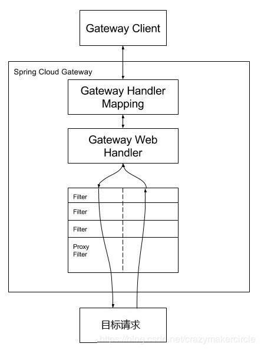
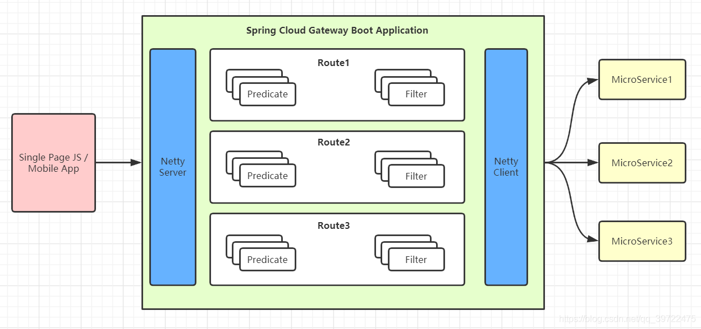
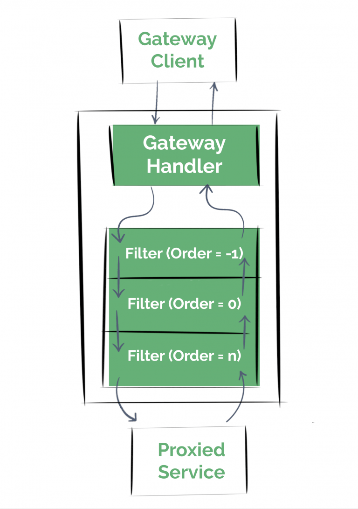

# springboot_gateway
微服务网关概述
不同的微服务一般会有不同的网络地址，而外部客户端可能需要调用多个服务的接口才能完成一个业务需求，如果让客户端直接与各个微服务通信，会有以下的问题：

客户端会多次请求不同的微服务，增加了客户端的复杂性

存在跨域请求，在一定场景下处理相对复杂

认证复杂，每个服务都需要独立认证

难以重构，随着项目的迭代，可能需要重新划分微服务。例如，可能将多个服务合并成一个或者将一个服务拆分成多个。如果客户端直接与微服务通信，那么重构将会很难实施

某些微服务可能使用了防火墙 / 浏览器不友好的协议，直接访问会有一定的困难

以上这些问题可以借助网关解决。

网关是介于客户端和服务器端之间的中间层，所有的外部请求都会先经过 网关这一层。也就是说，API 的实现方面更多的考虑业务逻辑，而安全、性能、监控可以交由 网关来做，这样既提高业务灵活性又不缺安全性，典型的架构图如图所示：

优点如下：

安全 ，只有网关系统对外进行暴露，微服务可以隐藏在内网，通过防火墙保护。

易于监控。可以在网关收集监控数据并将其推送到外部系统进行分析。

易于认证。可以在网关上进行认证，然后再将请求转发到后端的微服务，而无须在每个微服务中进行认证。

减少了客户端与各个微服务之间的交互次数

易于统一鉴权。

总结：微服务网关就是一个系统，通过暴露该微服务网关系统，方便我们进行相关的鉴权，安全控制，日志统一处理，易于监控的相关功能。

实现微服务网关的技术有很多，

nginx Nginx (engine x) 是一个高性能的HTTP和反向代理web服务器，同时也提供了IMAP/POP3/SMTP服务

zuul ,Zuul 是 Netflix 出品的一个基于 JVM 路由和服务端的负载均衡器。

spring-cloud-gateway, 是spring 出品的 基于spring 的网关项目，集成断路器，路径重写，性能比Zuul好。

我们使用gateway这个网关技术，无缝衔接到基于spring cloud的微服务开发中来。

网关简介
SpringCloud Gateway 是 Spring Cloud 的一个全新项目，该项目是基于 Spring 5.0，Spring Boot 2.0 和 Project Reactor 等技术开发的网关，它旨在为微服务架构提供一种简单有效的统一的 API 路由管理方式。
SpringCloud Gateway 作为 Spring Cloud 生态系统中的网关，目标是替代 Zuul，在Spring Cloud 2.0以上版本中，没有对新版本的Zuul 2.0以上最新高性能版本进行集成，仍然还是使用的Zuul 2.0之前的非Reactor模式的老版本。而为了提升网关的性能，SpringCloud Gateway是基于WebFlux框架实现的，而WebFlux框架底层则使用了高性能的Reactor模式通信框架Netty。
Spring Cloud Gateway 的目标，不仅提供统一的路由方式，并且基于 Filter 链的方式提供了网关基本的功能，例如：安全，监控/指标，和限流。
提前声明：Spring Cloud Gateway 底层使用了高性能的通信框架Netty。

网关特征
SpringCloud官方，对SpringCloud Gateway 特征介绍如下：
    （1）基于 Spring Framework 5，Project Reactor 和 Spring Boot 2.0
    （2）集成 Hystrix 断路器
    （3）集成 Spring Cloud DiscoveryClient
    （4）Predicates 和 Filters 作用于特定路由，易于编写的 Predicates 和 Filters
    （5）具备一些网关的高级功能：动态路由、限流、路径重写
    从以上的特征来说，和Zuul的特征差别不大。SpringCloud Gateway和Zuul主要的区别，还是在底层的通信框架上。
简单说明一下上文中的三个术语：
    （1）Filter（过滤器）：
    和Zuul的过滤器在概念上类似，可以使用它拦截和修改请求，并且对上游的响应，进行二次处理。过滤器为org.springframework.cloud.gateway.filter.GatewayFilter类的实例。
    （2）Route（路由）：
    网关配置的基本组成模块，和Zuul的路由配置模块类似。一个Route模块由一个 ID，一个目标 URI，一组断言和一组过滤器定义。如果断言为真，则路由匹配，目标URI会被访问。
    （3）Predicate（断言）：
    这是一个 Java 8 的 Predicate，可以使用它来匹配来自 HTTP 请求的任何内容，例如 headers 或参数。断言的输入类型是一个 ServerWebExchange。

网关的处理流程：
客户端向 Spring Cloud Gateway 发出请求。然后在 Gateway Handler Mapping 中找到与请求相匹配的路由，将其发送到 Gateway Web Handler。Handler 再通过指定的过滤器链来将请求发送到我们实际的服务执行业务逻辑，然后返回。  
过滤器之间用虚线分开是因为过滤器可能会在发送代理请求之前（“pre”）或之后（“post”）执行业务逻辑。

路由的配置方式两种：
1. 在yml中进行配置路由
2. 在代码中进行路由的配置

路由的配置规则：
Spring Cloud Gateway 的功能很强大，我们仅仅通过 Predicates 的设计就可以看出来，前面我们只是使用了 predicates 进行了简单的条件匹配，其实 Spring Cloud Gataway 帮我们内置了很多 Predicates 功能。
Spring Cloud Gateway 是通过 Spring WebFlux 的 HandlerMapping 做为底层支持来匹配到转发路由，Spring Cloud Gateway 内置了很多 Predicates 工厂，这些 Predicates 工厂通过不同的 HTTP 请求参数来匹配，多个 Predicates 工厂可以组合使用。

gateWay的主要功能之一是转发请求，转发规则的定义主要包含三个部分
1. Route（路由）	路由是网关的基本单元，由ID、URI、一组Predicate、一组Filter组成，根据Predicate进行匹配转发。
2. Predicate（谓语、断言）	路由转发的判断条件，目前SpringCloud Gateway支持多种方式，常见如：Path、Query、Method、Header等，写法必须遵循 key=vlue的形式
3. Filter（过滤器）	过滤器是路由转发请求时所经过的过滤逻辑，可用于修改请求、响应内容
注：其中Route和Predicate必须同时申明

Predicate 断言条件(转发规则)介绍：
    Predicate 来源于 Java 8，是 Java 8 中引入的一个函数，Predicate 接受一个输入参数，返回一个布尔值结果。  
    该接口包含多种默认方法来将 Predicate 组合成其他复杂的逻辑（比如：与，或，非）。可以用于接口请求参数校验、判断新老数据是否有变化需要进行更新操作。
    在 Spring Cloud Gateway 中 Spring 利用 Predicate 的特性实现了各种路由匹配规则，有通过 Header、请求参数等不同的条件来进行作为条件匹配到对应的路由。  
    网上有一张图总结了 Spring Cloud 内置的几种 Predicate 的实现。
    .png)
    说白了 Predicate 就是为了实现一组匹配规则，方便让请求过来找到对应的 Route 进行处理，接下来我们看下 Spring Cloud GateWay 内置几种 Predicate 的使用：

    转发规则（predicates），假设 转发uri都设定为http://localhost:9023
    | 规则 | 实例 | 说明 |
    | Path | - Path=/gate/**,/rule/** | ## 当请求的路径为gate、rule开头的时，转发到http://localhost:9023服务器上 |
    | Before | - Before=2017-01-20T17:42:47.789-07:00[America/Denver] |  在某个时间之前的请求才会被转发到 http://localhost:9023服务器上 |
    | After | - After=2017-01-20T17:42:47.789-07:00[America/Denver] | 在某个时间之后的请求才会被转发 |
    | Betwee  |  - Between=2017-01-20T17:42:47.789-07:00[America/Denver],2017-01-21T17:42:47.789-07:00[America/Denver] |  在某个时间段之间的才会被转发 |
    | Cookie | - Cookie=chocolate, ch.p | 名为chocolate的表单或者满足正则ch.p的表单才会被匹配到进行请求转发 |
    | Header | - Header=X-Request-Id, \d+  | 携带参数X-Request-Id或者满足\d+的请求头才会匹配  |
    | Host | - Host=www.hd123.com | 当主机名为www.hd123.com的时候直接转发到http://localhost:9023服务器上 |
    | Method | - Method=GET	| 只有GET方法才会匹配转发请求，还可以限定POST、PUT等请求方式  |
    
    #断言predicates的属性可以有：
    #Path：Path=/**
    #Cookie：Cookie=chocolate, ch.p，前面的为name，逗号后面的为值
    #Header：Header=X-Request-Id, \d+，前面的为name，逗号后面的为值
    #Host：Host=**.somehost.org,**.anotherhost.org
    #Method：Method=GET
    #Query：Query=aaa，请求参数必须有name为aaa的参数；Query=aaa, 111：请求参数必须有name为aaa的参数，且aaa参数的值为111；Query=keep, pu. 当请求中包含 keep 属性并且参数值是以 pu 开头的长度为三位的字符串才会进行匹配和路由
    #After：After=2021-03-17T15:47:51.534+08:00[Asia/Shanghai]，日期时间，在该日期以后请求才被匹配，时间可以使用java.time.ZonedDateTime中的ZonedDateTime.now()获取当前时间
    #Before：Before=2022-03-17T15:47:51.534+08:00[Asia/Shanghai]，日期时间，在该日期之前才被匹配
    #Between：Between=2021-03-17T15:47:51.534+08:00[Asia/Shanghai],2022-03-17T15:47:51.534+08:00[Asia/Shanghai]，使用两个参数用逗号分隔，在两个时间范围内的请求才被匹配
    #RemoteAddr：RemoteAddr=192.168.1.1/24
    权重路由工厂有两个参数：group和Weight(int)。每组计算重量。示例：predicates：- Weight=group1, 2；在group1这个分组中，将会有20%的流量流向它
    组合使用：各种 Predicates 同时存在于同一个路由时，请求必须同时满足所有的条件才被这个路由匹配。一个请求满足多个路由的断言条件时，请求只会被首个成功匹配的路由转发

Filter 过滤器规则

    注：当配置多个filter时，优先定义的会被调用，剩余的filter将不会生效

    | 过滤规则 | 实例 | 说明 |
    | PrefixPath | - PrefixPath=/app | 在请求路径前加上app |
    | RewritePath | - RewritePath=/test, /app/test | 访问localhost:9022/test,请求会转发到localhost:8001/app/test |
    | RewritePath | RewritePath=/where(?<segment>/?.*), /test(?<segment>/?.*) | 改写路径：/where/... 改成 test/... |
    | SetPath | SetPath=/app/{path} | 通过模板设置路径，转发的规则时会在路径前增加app，{path}表示原请求路径 |
    | RedirectTo | - RedirectTo=302, https://acme.org | 重定向，配置包含重定向的返回码和地址 |
    | RemoveRequestHeader | - RemoveRequestHeader=X-Request-Foo | 去掉某个请求头信息 |
    | RemoveResponseHeader | - RemoveResponseHeader=X-Request-Foo | 去掉某个回执头信息 |
    | RemoveRequestParameter | - RemoveRequestParameter=red | 去掉某个请求参数信息 |

熔断降级
    为什么要实现熔断降级？
    在分布式系统中，网关作为流量的入口，因此会有大量的请求进入网关，向其他服务发起调用，其他服务不可避免的会出现调用失败（超时、异常），失败时不能让请求堆积在网关上，需要快速失败并返回给客户端，想要实现这个要求，就必须在网关上做熔断、降级操作。
    为什么在网关上请求失败需要快速返回给客户端？
    因为当一个客户端请求发生故障的时候，这个请求会一直堆积在网关上，当然只有一个这种请求，网关肯定没有问题（如果一个请求就能造成整个系统瘫痪，那这个系统可以下架了），但是网关上堆积多了就会给网关乃至整个服务都造成巨大的压力，甚至整个服务宕掉。因此要对一些服务和页面进行有策略的降级，以此缓解服务器资源的的压力，以保证核心业务的正常运行，同时也保持了客户和大部分客户的得到正确的相应，所以需要网关上请求失败需要快速返回给客户端。

    spring:
      cloud:
        # 网关
        gateway:
          routes:
            #       用户相关配置路由
            # 我们自定义的路由 ID，保持唯一
            - id: usercenter
              # 目标服务地址，lb:从微服务注册中心（如Eureka）订阅服务，并且进行服务的路由。
              uri: lb://HRSS-USER-CENTER
              # 路由条件，Predicate 接受一个输入参数，返回一个布尔值结果。该接口包含多种默认方法来将 Predicate 组合成其他复杂的逻辑（比如：与，或，非）。
              predicates:
                - Path=/usercenter/v1/**
              filters:
                # 请求路径前加上/app
                - PrefixPath=/app
                # 过滤器StripPrefix，作用是去掉请求路径的最前面n个部分截取掉。/test/good/1/view->/good/1/view
                - StripPrefi1=1
                # 通过Hystrix进行熔断降级
                - name: Hystrix
                  args:
                    name: fallbackCmdA
                    # 转发到指定路径，进行响应
                    fallbackUri: forward:/fallbackA
这里的配置，使用了两个过滤器：
（1）过滤器StripPrefix，作用是去掉请求路径的最前面n个部分截取掉。
StripPrefix=1就代表截取路径的个数为1，比如前端过来请求/test/good/1/view，匹配成功后，路由到后端的请求路径就会变成http://localhost:8888/good/1/view。
（2）过滤器Hystrix，作用是通过Hystrix进行熔断降级
当上游的请求，进入了Hystrix熔断降级机制时，就会调用fallbackUri配置的降级地址。需要注意的是，还需要单独设置Hystrix的commandKey的超时时间
fallbackUri配置的降级地址的代码：[FallbackController.java: Line 8](src/main/java/com/gateway/controller/FallbackController.java#L8)

过滤器
Spring-Cloud-Gateway 基于过滤器实现，同 zuul 类似，有pre和post两种方式的 filter,分别处理前置逻辑和后置逻辑。客户端的请求先经过pre类型的 filter，然后将请求转发到具体的业务服务，收到业务服务的响应之后，再经过post类型的 filter 处理，最后返回响应到客户端。
过滤器执行流程如下，order 越大，优先级越低

分为全局过滤器和局部过滤器
全局过滤器：对所有路由生效，接口用时统计
局部过滤器：对指定路由生效
1. 定义全局过滤器：【AGlobalFilter，BGlobalFilter】
    实现 GlobalFilter 和 Ordered(执行顺序)，重写相关方法，加入到spring容器管理即可，无需配置，模式系统初始化时加载，并作用在每个路由上，全局过滤器对所有的路由都有效。
    GatewayFilter是从WebFilter中Copy过来的，相当于一个Filter过滤器，可以对访问的URL过滤横切处理，应用场景比如超时，安全等。
2. 定义局部过滤器：
    1.实现GatewayFilter 和 Ordered，实现相关的方法。【AGatewayFilter】
    2.加入到过滤器工厂，并且注册到spring容器中。【AGatewayFilterFactory】
    3.在配置文件中进行配置，如果不配置则不启用此过滤器规则。【yml文件中，filter: 下面】
3. 两者的区别
    GatewayFilter和GlobalFilter两个都设置的时候，order中设置的优先级在两个里面是分割开的。先执行完GatewayFilter的所有逻辑再执行GlobalFilter中的逻辑
    在一个高的角度来看，GlobalFilter会被应用到所有的路由上，而GatewayFilter将应用到单个路由上或者一个分组的路由上。
    GatewayFilter和GlobalFilter两个接口中定义的方法一样都是Mono<Void> filter(ServerWebExchange exchange, GatewayFilterChain chain)
    唯一的区别就是GatewayFilter继承了ShortcutConfigurable，GlobalFilter没有任何继承。

springboot版本号 2.4.5/2.4.2报错，原因是springboot和springCloud版本不匹配，2.3.3.RELEASE适用
Caused by: java.lang.ClassNotFoundException: org.springframework.boot.context.properties.ConfigurationBeanFactoryMetadata

spring-cloud-starter-gateway中包含了spring-boot-starter-web，需要去除web包
Consider defining a bean of type 'org.springframework.http.codec.ServerCodecConfigurer' in your configuration.