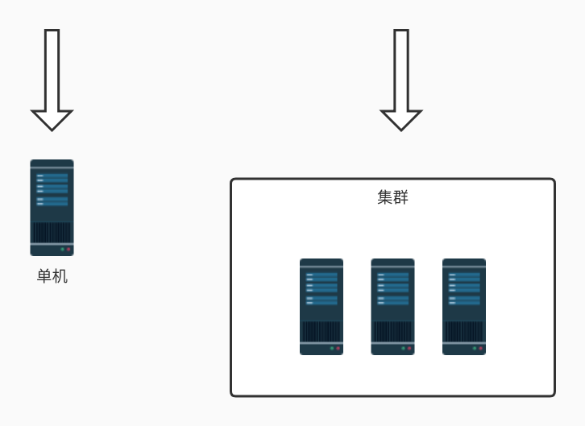

# springboot_gateway
微服务网关概述
不同的微服务一般会有不同的网络地址，而外部客户端可能需要调用多个服务的接口才能完成一个业务需求，如果让客户端直接与各个微服务通信，会有以下的问题：

客户端会多次请求不同的微服务，增加了客户端的复杂性

存在跨域请求，在一定场景下处理相对复杂

认证复杂，每个服务都需要独立认证

难以重构，随着项目的迭代，可能需要重新划分微服务。例如，可能将多个服务合并成一个或者将一个服务拆分成多个。如果客户端直接与微服务通信，那么重构将会很难实施

某些微服务可能使用了防火墙 / 浏览器不友好的协议，直接访问会有一定的困难

以上这些问题可以借助网关解决。

网关是介于客户端和服务器端之间的中间层，所有的外部请求都会先经过 网关这一层。也就是说，API 的实现方面更多的考虑业务逻辑，而安全、性能、监控可以交由 网关来做，这样既提高业务灵活性又不缺安全性，典型的架构图如图所示：

优点如下：

安全 ，只有网关系统对外进行暴露，微服务可以隐藏在内网，通过防火墙保护。

易于监控。可以在网关收集监控数据并将其推送到外部系统进行分析。

易于认证。可以在网关上进行认证，然后再将请求转发到后端的微服务，而无须在每个微服务中进行认证。

减少了客户端与各个微服务之间的交互次数

易于统一鉴权。

总结：微服务网关就是一个系统，通过暴露该微服务网关系统，方便我们进行相关的鉴权，安全控制，日志统一处理，易于监控的相关功能。

实现微服务网关的技术有很多，

nginx Nginx (engine x) 是一个高性能的HTTP和反向代理web服务器，同时也提供了IMAP/POP3/SMTP服务

zuul ,Zuul 是 Netflix 出品的一个基于 JVM 路由和服务端的负载均衡器。

spring-cloud-gateway, 是spring 出品的 基于spring 的网关项目，集成断路器，路径重写，性能比Zuul好。

我们使用gateway这个网关技术，无缝衔接到基于spring cloud的微服务开发中来。

网关简介
API网关是一个服务器，是系统的唯一入口。从面向对象设计的角度看，它与外观模式类似。API网关封装了系统内部架构，为每个客户端提供一个定制的API。它可能还具有其它职责，如身份验证、监控、负载均衡、缓存、请求分片与管理、静态响应处理。API网关方式的核心要点是，所有的客户端和消费端都通过统一的网关接入微服务，在网关层处理所有的非业务功能。通常，网关也是提供REST/HTTP的访问API。
SpringCloud Gateway 是 Spring Cloud 的一个全新项目，该项目是基于 Spring 5.0，Spring Boot 2.0 和 Project Reactor 等技术开发的网关，它旨在为微服务架构提供一种简单有效的统一的 API 路由管理方式。
SpringCloud Gateway 作为 Spring Cloud 生态系统中的网关，目标是替代 Zuul，在Spring Cloud 2.0以上版本中，没有对新版本的Zuul 2.0以上最新高性能版本进行集成，仍然还是使用的Zuul 2.0之前的非Reactor模式的老版本。而为了提升网关的性能，SpringCloud Gateway是基于WebFlux框架实现的，而WebFlux框架底层则使用了高性能的Reactor模式通信框架Netty。
Spring Cloud Gateway 的目标，不仅提供统一的路由方式，并且基于 Filter 链的方式提供了网关基本的功能，例如：安全，监控/指标，和限流。
提前声明：Spring Cloud Gateway 底层使用了高性能的通信框架Netty。

网关应当具备以下功能：
1. 性能：API高可用，负载均衡，容错机制。
2. 安全：权限身份认证、脱敏，流量清洗，后端签名（保证全链路可信调用）,黑名单（非法调用的限制）。
3. 日志：日志记录（spainid,traceid）一旦涉及分布式，全链路跟踪必不可少。
4. 缓存：数据缓存。
5. 监控：记录请求响应数据，api耗时分析，性能监控。
6. 限流：流量控制，错峰流控，可以定义多种限流规则。全局性流量控制，服务级别流量控制
7. 灰度：线上灰度部署，可以减小风险。
8. 路由：动态路由规则。
9. 防止sql注入，防止web攻击，屏蔽工具扫描，证书、加解密处理，黑白IP名单，降级熔断业务规则参数校验
限流，熔断，隔离，缓存，降级
API网关作为后端服务的统一入口，可提供请求路由、协议转换、安全认证、服务鉴权、流量控制、日志监控等服务。
  
以上功能对系统的稳定性和健壮性至关重要。

nginx和Spring Cloud Gateway在功能上是有一些重叠的地方，都可以做服务转发。  
但是网关在大型微服务系统中是一个很重的角色，Spring Cloud Gateway是专为为网关的角色而设计的，功能强大，而且是官方出品，所以在大型系统开发中基本上都会选用此组件。  
而nginx只能实现一些上面所说的一部分功能，一般都是选择nginx做静态资源缓存和前端调用接口的负载均衡。  
现在前后端分离的系统一般都是如下设计：  
    nginx做静态资源服务器，前端页面调用后台接口时先请求到nginx，nginx负载均衡路由到后端网关（gateway），  
    然后网关做请求身份验证，服务路由，日志记录等等操作，再转发业务处理接口，处理完返回数据。

网关特征
SpringCloud官方，对SpringCloud Gateway 特征介绍如下：
    （1）基于 Spring Framework 5，Project Reactor 和 Spring Boot 2.0
    （2）集成 Hystrix 断路器
    （3）集成 Spring Cloud DiscoveryClient
    （4）Predicates 和 Filters 作用于特定路由，易于编写的 Predicates 和 Filters
    （5）具备一些网关的高级功能：动态路由、限流、路径重写
    从以上的特征来说，和Zuul的特征差别不大。SpringCloud Gateway和Zuul主要的区别，还是在底层的通信框架上。
简单说明一下上文中的三个术语：
    （1）Filter（过滤器）：
    和Zuul的过滤器在概念上类似，可以使用它拦截和修改请求，并且对上游的响应，进行二次处理。过滤器为org.springframework.cloud.gateway.filter.GatewayFilter类的实例。
    （2）Route（路由）：
    网关配置的基本组成模块，和Zuul的路由配置模块类似。一个Route模块由一个 ID，一个目标 URI，一组断言和一组过滤器定义。如果断言为真，则路由匹配，目标URI会被访问。
    （3）Predicate（断言/谓词）：
    这是一个 Java 8 的 Predicate，可以使用它来匹配来自 HTTP 请求的任何内容，例如 headers 或参数。断言的输入类型是一个 ServerWebExchange。

网关的处理流程：
客户端向 Spring Cloud Gateway 发出请求。然后在 Gateway Handler Mapping 中找到与请求相匹配的路由，将其发送到 Gateway Web Handler。Handler 再通过指定的过滤器链来将请求发送到我们实际的服务执行业务逻辑，然后返回。  
过滤器之间用虚线分开是因为过滤器可能会在发送代理请求之前（“pre”）或之后（“post”）执行业务逻辑。

路由的配置方式两种：
1. 在yml中进行配置路由
2. 在代码中进行路由的配置

路由的配置规则：
Spring Cloud Gateway 的功能很强大，我们仅仅通过 Predicates 的设计就可以看出来，前面我们只是使用了 predicates 进行了简单的条件匹配，其实 Spring Cloud Gataway 帮我们内置了很多 Predicates 功能。
Spring Cloud Gateway 是通过 Spring WebFlux 的 HandlerMapping 做为底层支持来匹配到转发路由，Spring Cloud Gateway 内置了很多 Predicates 工厂，这些 Predicates 工厂通过不同的 HTTP 请求参数来匹配，多个 Predicates 工厂可以组合使用。

gateWay的主要功能之一是转发请求，转发规则的定义主要包含三个部分
1. Route（路由）	路由是网关的基本单元，由ID、URI、一组Predicate、一组Filter组成，根据Predicate进行匹配转发。
2. Predicate（谓语、断言）	路由转发的判断条件，目前SpringCloud Gateway支持多种方式，常见如：Path、Query、Method、Header等，写法必须遵循 key=vlue的形式
3. Filter（过滤器）	过滤器是路由转发请求时所经过的过滤逻辑，可用于修改请求、响应内容
注：其中Route和Predicate必须同时申明

Predicate 断言条件(转发规则)介绍：
    Predicate 来源于 Java 8，是 Java 8 中引入的一个函数，Predicate 接受一个输入参数，返回一个布尔值结果。  
    该接口包含多种默认方法来将 Predicate 组合成其他复杂的逻辑（比如：与，或，非）。可以用于接口请求参数校验、判断新老数据是否有变化需要进行更新操作。
    在 Spring Cloud Gateway 中 Spring 利用 Predicate 的特性实现了各种路由匹配规则，有通过 Header、请求参数等不同的条件来进行作为条件匹配到对应的路由。  
    网上有一张图总结了 Spring Cloud 内置的几种 Predicate 的实现。
    .png)
    说白了 Predicate 就是为了实现一组匹配规则，方便让请求过来找到对应的 Route 进行处理，接下来我们看下 Spring Cloud GateWay 内置几种 Predicate 的使用：

    转发规则（predicates），假设 转发uri都设定为http://localhost:9023
    | 规则 | 实例 | 说明 |
    | Path | - Path=/gate/**,/rule/** | ## 当请求的路径为gate、rule开头的时，转发到http://localhost:9023服务器上 |
    | Before | - Before=2017-01-20T17:42:47.789-07:00[America/Denver] |  在某个时间之前的请求才会被转发到 http://localhost:9023服务器上 |
    | After | - After=2017-01-20T17:42:47.789-07:00[America/Denver] | 在某个时间之后的请求才会被转发 |
    | Betwee  |  - Between=2017-01-20T17:42:47.789-07:00[America/Denver],2017-01-21T17:42:47.789-07:00[America/Denver] |  在某个时间段之间的才会被转发 |
    | Cookie | - Cookie=chocolate, ch.p | 名为chocolate的表单或者满足正则ch.p的表单才会被匹配到进行请求转发 |
    | Header | - Header=X-Request-Id, \d+  | 携带参数X-Request-Id或者满足\d+的请求头才会匹配  |
    | Host | - Host=www.hd123.com | 当主机名为www.hd123.com的时候直接转发到http://localhost:9023服务器上 |
    | Method | - Method=GET	| 只有GET方法才会匹配转发请求，还可以限定POST、PUT等请求方式  |
    
    #断言predicates的属性可以有：
    #Path：Path=/**
    #Cookie：Cookie=chocolate, ch.p，前面的为name，逗号后面的为值
    #Header：Header=X-Request-Id, \d+，前面的为name，逗号后面的为值
    #Host：Host=**.somehost.org,**.anotherhost.org
    #Method：Method=GET
    #Query：Query=aaa，请求参数必须有name为aaa的参数；Query=aaa, 111：请求参数必须有name为aaa的参数，且aaa参数的值为111；Query=keep, pu. 当请求中包含 keep 属性并且参数值是以 pu 开头的长度为三位的字符串才会进行匹配和路由
    #After：After=2021-03-17T15:47:51.534+08:00[Asia/Shanghai]，日期时间，在该日期以后请求才被匹配，时间可以使用java.time.ZonedDateTime中的ZonedDateTime.now()获取当前时间
    #Before：Before=2022-03-17T15:47:51.534+08:00[Asia/Shanghai]，日期时间，在该日期之前才被匹配
    #Between：Between=2021-03-17T15:47:51.534+08:00[Asia/Shanghai],2022-03-17T15:47:51.534+08:00[Asia/Shanghai]，使用两个参数用逗号分隔，在两个时间范围内的请求才被匹配
    #RemoteAddr：RemoteAddr=192.168.1.1/24
    权重路由工厂有两个参数：group和Weight(int)。每组计算重量。示例：predicates：- Weight=group1, 2；在group1这个分组中，将会有20%的流量流向它
    组合使用：各种 Predicates 同时存在于同一个路由时，请求必须同时满足所有的条件才被这个路由匹配。一个请求满足多个路由的断言条件时，请求只会被首个成功匹配的路由转发
    注：当一个请求满足多个路由的谓词条件时，请求只会被首个成功匹配的路由转发

Filter 过滤器规则

    注：当配置多个filter时，优先定义的会被调用，剩余的filter将不会生效

    | 过滤规则 | 实例 | 说明 |
    | PrefixPath | - PrefixPath=/app | 在请求路径前加上app |
    | RewritePath | - RewritePath=/test, /app/test | 访问localhost:9022/test,请求会转发到localhost:8001/app/test |
    | RewritePath | RewritePath=/where(?<segment>/?.*), /test(?<segment>/?.*) | 改写路径：/where/... 改成 test/... |
    | SetPath | SetPath=/app/{path} | 通过模板设置路径，转发的规则时会在路径前增加app，{path}表示原请求路径 |
    | RedirectTo | - RedirectTo=302, https://acme.org | 重定向，配置包含重定向的返回码和地址 |
    | RemoveRequestHeader | - RemoveRequestHeader=X-Request-Foo | 去掉某个请求头信息 |
    | RemoveResponseHeader | - RemoveResponseHeader=X-Request-Foo | 去掉某个回执头信息 |
    | RemoveRequestParameter | - RemoveRequestParameter=red | 去掉某个请求参数信息 |

熔断降级
    为什么要实现熔断降级？
    在分布式系统中，网关作为流量的入口，因此会有大量的请求进入网关，向其他服务发起调用，其他服务不可避免的会出现调用失败（超时、异常），失败时不能让请求堆积在网关上，需要快速失败并返回给客户端，想要实现这个要求，就必须在网关上做熔断、降级操作。
    为什么在网关上请求失败需要快速返回给客户端？
    因为当一个客户端请求发生故障的时候，这个请求会一直堆积在网关上，当然只有一个这种请求，网关肯定没有问题（如果一个请求就能造成整个系统瘫痪，那这个系统可以下架了），但是网关上堆积多了就会给网关乃至整个服务都造成巨大的压力，甚至整个服务宕掉。因此要对一些服务和页面进行有策略的降级，以此缓解服务器资源的的压力，以保证核心业务的正常运行，同时也保持了客户和大部分客户的得到正确的相应，所以需要网关上请求失败需要快速返回给客户端。

    spring:
      cloud:
        # 网关
        gateway:
          routes:
            #       用户相关配置路由
            # 我们自定义的路由 ID，保持唯一
            - id: usercenter
              # 目标服务地址，lb:从微服务注册中心（如Eureka）订阅服务，并且进行服务的路由。
              uri: lb://HRSS-USER-CENTER
              # 路由条件，Predicate 接受一个输入参数，返回一个布尔值结果。该接口包含多种默认方法来将 Predicate 组合成其他复杂的逻辑（比如：与，或，非）。
              predicates:
                - Path=/usercenter/v1/**
              filters:
                # 请求路径前加上/app
                - PrefixPath=/app
                # 过滤器StripPrefix，作用是去掉请求路径的最前面n个部分截取掉。/test/good/1/view->/good/1/view
                - StripPrefi1=1
                # 通过Hystrix进行熔断降级
                - name: Hystrix
                  args:
                    name: fallbackCmdA
                    # 转发到指定路径，进行响应
                    fallbackUri: forward:/fallbackA
这里的配置，使用了两个过滤器：
（1）过滤器StripPrefix，作用是去掉请求路径的最前面n个部分截取掉。
StripPrefix=1就代表截取路径的个数为1，比如前端过来请求/test/good/1/view，匹配成功后，路由到后端的请求路径就会变成http://localhost:8888/good/1/view。
（2）过滤器Hystrix，作用是通过Hystrix进行熔断降级
当上游的请求，进入了Hystrix熔断降级机制时，就会调用fallbackUri配置的降级地址。需要注意的是，还需要单独设置Hystrix的commandKey的超时时间
fallbackUri配置的降级地址的代码：[FallbackController.java: Line 8](src/main/java/com/gateway/controller/FallbackController.java#L8)

过滤器
Spring-Cloud-Gateway 基于过滤器实现，同 zuul 类似，有pre和post两种方式的 filter,分别处理前置逻辑和后置逻辑。客户端的请求先经过pre类型的 filter，然后将请求转发到具体的业务服务，收到业务服务的响应之后，再经过post类型的 filter 处理，最后返回响应到客户端。
过滤器执行流程如下，order 越大，优先级越低

分为全局过滤器和局部过滤器
全局过滤器：对所有路由生效，接口用时统计
局部过滤器：对指定路由生效
1. 定义全局过滤器：【AGlobalFilter，BGlobalFilter】
    实现 GlobalFilter 和 Ordered(执行顺序)，重写相关方法，加入到spring容器管理即可，无需配置，模式系统初始化时加载，并作用在每个路由上，全局过滤器对所有的路由都有效。
    GatewayFilter是从WebFilter中Copy过来的，相当于一个Filter过滤器，可以对访问的URL过滤横切处理，应用场景比如超时，安全等。
2. 定义局部过滤器：
    1.实现GatewayFilter 和 Ordered，实现相关的方法。【AGatewayFilter】
    2.加入到过滤器工厂，并且注册到spring容器中。【AGatewayFilterFactory】
    3.在配置文件中进行配置，如果不配置则不启用此过滤器规则。【yml文件中，filter: 下面】
3. 两者的区别
    GatewayFilter和GlobalFilter两个都设置的时候，order中设置的优先级在两个里面是分割开的。先执行完GatewayFilter的所有逻辑再执行GlobalFilter中的逻辑
    在一个高的角度来看，GlobalFilter会被应用到所有的路由上，而GatewayFilter将应用到单个路由上或者一个分组的路由上。
    GatewayFilter和GlobalFilter两个接口中定义的方法一样都是Mono<Void> filter(ServerWebExchange exchange, GatewayFilterChain chain)
    唯一的区别就是GatewayFilter继承了ShortcutConfigurable，GlobalFilter没有任何继承。

springboot版本号 2.4.5/2.4.2报错，原因是springboot和springCloud版本不匹配，2.3.3.RELEASE适用
Caused by: java.lang.ClassNotFoundException: org.springframework.boot.context.properties.ConfigurationBeanFactoryMetadata

spring-cloud-starter-gateway中包含了spring-boot-starter-web，需要去除web包
Consider defining a bean of type 'org.springframework.http.codec.ServerCodecConfigurer' in your configuration.

**********************************************************************************************************************
网关限流
缓存、降级 和 限流 被称为高并发、分布式系统的三驾马车，网关作为整个分布式系统中的第一道关卡，限流功能自然必不可少。  
通过限流，可以控制服务请求的速率，从而提高系统应对突发大流量的能力，让系统更具弹性。限流有着很多实际的应用场景，比如双十一的秒杀活动， 12306 的抢票等。  
在高并发的应用中，限流是一个绕不开的话题。限流可以保障我们的 API 服务对所有用户的可用性，也可以防止网络攻击。  
一般开发高并发系统常见的限流有：限制总并发数（比如数据库连接池、线程池）、限制瞬时并发数（如 nginx 的 limit_conn 模块，用来限制瞬时并发连接数）、  
限制时间窗口内的平均速率（如 Guava 的 RateLimiter、nginx 的 limit_req 模块，限制每秒的平均速率）；  
其他还有如限制远程接口调用速率、限制 MQ 的消费速率。另外还可以根据网络连接数、网络流量、CPU 或内存负载等来限流。

限流的场景：
    限制某个接口一分钟内最多请求 100 次  
    限制某个用户的下载速度最多 100KB/S  
    限制某个用户同时只能对某个接口发起 5 路请求  
    限制某个 IP 来源禁止访问任何请求  
    从上面的例子可以看出，根据不同的请求者和请求资源，可以组合出不同的限流规则。可以根据请求者的 IP 来进行限流，或者根据请求对应的用户来限流，又或者根据某个特定的请求参数来限流。而限流的对象可以是请求的频率，传输的速率，或者并发量等，其中最常见的两个限流对象是请求频率和并发量，他们对应的限流被称为 请求频率限流（Request rate limiting）和 并发量限流（Concurrent requests limiting）。传输速率限流 在下载场景下比较常用，比如一些资源下载站会限制普通用户的下载速度，只有购买会员才能提速，这种限流的做法实际上和请求频率限流类似，只不过一个限制的是请求量的多少，一个限制的是请求数据报文的大小。

限流的处理方式
在系统中设计限流方案时，有一个问题值得设计者去仔细考虑，当请求者被限流规则拦截之后，我们该如何返回结果。一般我们有下面三种限流的处理方式：
    拒绝服务
    排队等待
    服务降级
最简单的做法是拒绝服务，直接抛出异常，返回错误信息（比如返回 HTTP 状态码 429 Too Many Requests），或者给前端返回 302 重定向到一个错误页面，提示用户资源没有了或稍后再试【12306在高峰期就是直接报错】。但是对于一些比较重要的接口不能直接拒绝，比如秒杀、下单等接口，我们既不希望用户请求太快，也不希望请求失败，这种情况一般会将请求放到一个消息队列中排队等待，消息队列可以起到削峰和限流的作用。第三种处理方式是服务降级，当触发限流条件时，直接返回兜底数据，比如查询商品库存的接口，可以默认返回有货。

限流的架构：
针对不同的系统架构，需要使用不同的限流方案。如下图所示，服务部署的方式一般可以分为单机模式和集群模式：  

单机模式的限流非常简单，可以直接基于内存就可以实现，而集群模式的限流必须依赖于某个“中心化”的组件，比如网关或 Redis，从而引出两种不同的限流架构：网关层限流 和 中间件限流。  

1. 网关层限流
    网关作为整个分布式系统的入口，承担了所有的用户请求，所以在网关中进行限流是最合适不过的。网关层限流有时也被称为 接入层限流。除了我们使用的 Spring Cloud Gateway，最常用的网关层组件还有 Nginx，可以通过它的 ngx_http_limit_req_module 模块，使用 limit_conn_zone、limit_req_zone、limit_rate 等指令很容易的实现并发量限流、请求频率限流和传输速率限流。
2. 中间件限流
    中间件限流，可以将限流的逻辑下沉到服务层。但是集群中的每个服务必须将自己的流量信息统一汇总到某个地方供其他服务读取，一般来说用 Redis 的比较多，Redis 提供的过期特性和 lua 脚本执行非常适合做限流。除了 Redis 这种中间件，还有很多类似的分布式缓存系统都可以使用，如 Hazelcast、Apache Ignite、Infinispan 等。  
我们可以更进一步扩展上面的架构，将网关改为集群模式，虽然这还是网关层限流架构，但是由于网关变成了集群模式，所以网关必须依赖于中间件进行限流，这和上面讨论的中间件限流没有区别。
  
通过上面的描述，我们知道限流可以分为请求频率限流和并发量限流，根据系统架构的不同，又可以分为网关层限流和分布式限流。在不同的应用场景下，我们需要采用不同的限流算法。

限流算法：
做限流 (Rate Limiting/Throttling) 的时候，除了简单的控制并发，如果要准确的控制 TPS，简单的做法是维护一个单位时间内的 Counter，  
如判断单位时间已经过去，则将 Counter 重置零。此做法被认为没有很好的处理单位时间的边界，比如在前一秒的最后一毫秒里和下一秒的第一毫秒都触发了最大的请求数，  
也就是在两毫秒内发生了两倍的 TPS。  
常用的更平滑的限流算法有两种：漏桶算法和令牌桶算法。
1. 固定窗口算法（Fixed Window）
    固定窗口算法是一种最简单的限流算法，它根据限流的条件，将请求时间映射到一个时间窗口，再使用计数器累加访问次数。譬如限流条件为每分钟 5 次，那么就按照分钟为单位映射时间窗口，假设一个请求时间为 11:00:45，时间窗口就是 11:00:00 ~ 11:00:59，在这个时间窗口内设定一个计数器，每来一个请求计数器加一，当这个时间窗口的计数器超过 5 时，就触发限流条件。当请求时间落在下一个时间窗口内时（11:01:00 ~ 11:01:59），上一个窗口的计数器失效，当前的计数器清零，重新开始计数。  
    计数器算法非常容易实现，在单机场景下可以使用 AtomicLong、LongAdder 或 Semaphore 来实现计数，而在分布式场景下可以通过 Redis 的 INCR 和 EXPIRE 等命令并结合 EVAL 或 lua 脚本来实现，Redis 官网提供了几种简单的实现方式。无论是请求频率限流还是并发量限流都可以使用这个算法。  
    不过这个算法的缺陷也比较明显，那就是存在严重的临界问题。由于每过一个时间窗口，计数器就会清零，这使得限流效果不够平滑，恶意用户可以利用这个特点绕过我们的限流规则。如下图所示，我们的限流条件本来是每分钟 5 次，但是恶意用户在 11:00:00 ~ 11:00:59 这个时间窗口的后半分钟发起 5 次请求，接下来又在 11:01:00 ~ 11:01:59 这个时间窗口的前半分钟发起 5 次请求，这样我们的系统就在 1 分钟内承受了 10 次请求。  
    
2. 滑动窗口算法（Rolling Window 或 Sliding Window）
    为了解决固定窗口算法的临界问题，可以将时间窗口划分成更小的时间窗口，然后随着时间的滑动删除相应的小窗口，而不是直接滑过一个大窗口，这就是滑动窗口算法。我们为每个小时间窗口都设置一个计数器，大时间窗口的总请求次数就是每个小时间窗口的计数器的和。如下图所示，我们的时间窗口是 5 秒，可以按秒进行划分，将其划分成 5 个小窗口，时间每过一秒，时间窗口就滑过一秒：  
      
    每次处理请求时，都需要计算所有小时间窗口的计数器的和，考虑到性能问题，划分的小时间窗口不宜过多，譬如限流条件是每小时 N 个，可以按分钟划分为 60 个窗口，而不是按秒划分成 3600 个。当然如果不考虑性能问题，划分粒度越细，限流效果就越平滑。相反，如果划分粒度越粗，限流效果就越不精确，出现临界问题的可能性也就越大，当划分粒度为 1 时，滑动窗口算法就退化成了固定窗口算法。由于这两种算法都使用了计数器，所以也被称为 计数器算法（Counters）。  
    进一步思考我们发现，如果划分粒度最粗，也就是只有一个时间窗口时，滑动窗口算法退化成了固定窗口算法；那如果我们把划分粒度调到最细，又会如何呢？那么怎样才能让划分的时间窗口最细呢？时间窗口细到一定地步时，意味着每个时间窗口中只能容纳一个请求，这样我们可以省略计数器，只记录每个请求的时间，然后统计一段时间内的请求数有多少个即可。具体的实现可以参考 这里的 Redis sorted set 技巧 和 这里的 Sliding window log 算法。
3. 漏桶算法（Leaky Bucket）
    漏桶（Leaky Bucket）算法思路很简单，水（请求）先进入到漏桶里，漏桶以一定的速度出水（接口有响应速率），当水流入速度过大会直接溢出（访问频率超过接口响应速率），然后就拒绝请求，可以看出漏桶算法能强行限制数据的传输速率。可见这里有两个变量，一个是桶的大小，支持流量突发增多时可以存多少的水（burst），另一个是水桶漏洞的大小（rate）。  
    漏桶算法假设将请求装到一个桶中，桶的容量为 M，当桶满时，请求被丢弃。在桶的底部有一个洞，桶中的请求像水一样按固定的速度（每秒 r 个）漏出来。我们用下面这个形象的图来表示漏桶算法：  
      
    桶的上面是个水龙头，我们的请求从水龙头流到桶中，水龙头流出的水速不定，有时快有时慢，这种忽快忽慢的流量叫做 Bursty flow。如果桶中的水满了，多余的水就会溢出去，相当于请求被丢弃。从桶底部漏出的水速是固定不变的，可以看出漏桶算法可以平滑请求的速率。
    漏桶算法可以通过一个队列来实现，如下图所示：  
    .png)  
    当请求到达时，不直接处理请求，而是将其放入一个队列，然后另一个线程以固定的速率从队列中读取请求并处理，从而达到限流的目的。注意的是这个队列可以有不同的实现方式，比如设置请求的存活时间，或将队列改造成 PriorityQueue，根据请求的优先级排序而不是先进先出。当然队列也有满的时候，如果队列已经满了，那么请求只能被丢弃了。漏桶算法有一个缺陷，在处理突发流量时效率很低，于是人们又想出了下面的令牌桶算法。  
    因为漏桶的漏出速率是固定的参数，所以，即使网络中不存在资源冲突（没有发生拥塞），漏桶算法也不能使流突发（burst）到端口速率。因此，漏桶算法对于存在突发特性的流量来说缺乏效率。
4. 令牌桶算法（Token Bucket）
    令牌桶算法（Token Bucket）是目前应用最广泛的一种限流算法，它的基本思想由两部分组成：生成令牌 和 消费令牌。  
    1）生成令牌：假设有一个装令牌的桶，最多能装 M 个，然后按某个固定的速度（每秒 r 个）往桶中放入令牌，桶满时不再放入；  
    2）消费令牌：我们的每次请求都需要从桶中拿一个令牌才能放行，当桶中没有令牌时即触发限流，这时可以将请求放入一个缓冲队列中排队等待，或者直接拒绝；  
    令牌桶算法实现：  
    在上面的图中，我们将请求放在一个缓冲队列中，可以看出这一部分的逻辑和漏桶算法几乎一模一样，只不过在处理请求上，一个是以固定速率处理，一个是从桶中获取令牌后才处理。  
    仔细思考就会发现，令牌桶算法有一个很关键的问题，就是桶大小的设置，正是这个参数可以让令牌桶算法具备处理突发流量的能力。譬如将桶大小设置为 100，生成令牌的速度设置为每秒 10 个，那么在系统空闲一段时间的之后（桶中令牌一直没有消费，慢慢的会被装满），突然来了 50 个请求，这时系统可以直接按每秒 50 个的速度处理，随着桶中的令牌很快用完，处理速度又会慢慢降下来，和生成令牌速度趋于一致。这是令牌桶算法和漏桶算法最大的区别，漏桶算法无论来了多少请求，只会一直以每秒 10 个的速度进行处理。当然，处理突发流量虽然提高了系统性能，但也给系统带来了一定的压力，如果桶大小设置不合理，突发的大流量可能会直接压垮系统。  
    通过上面对令牌桶的原理分析，一般会有两种不同的实现方式。第一种方式是启动一个内部线程，不断的往桶中添加令牌，处理请求时从桶中获取令牌，和上面图中的处理逻辑一样。第二种方式不依赖于内部线程，而是在每次处理请求之前先实时计算出要填充的令牌数并填充，然后再从桶中获取令牌。  
    令牌桶算法（Token Bucket）和 Leaky Bucket 效果一样但方向相反的算法，更加容易理解。  
随着时间流逝，系统会按恒定 1/QPS 时间间隔（如果 QPS=100，则间隔是 10ms）往桶里加入 Token（想象和漏洞漏水相反，有个水龙头在不断的加水），如果桶已经满了就不再加了。新请求来临时，会各自拿走一个 Token，如果没有 Token 可拿了就阻塞或者拒绝服务。
    令牌桶的另外一个好处是可以方便的改变速度。一旦需要提高速率，则按需提高放入桶中的令牌的速率。一般会定时（比如 100 毫秒）往桶中增加一定数量的令牌，
有些变种算法则实时的计算应该增加的令牌的数量。Guava 中的 RateLimiter 采用了令牌桶的算法。  
    

Bucket4j 是一个基于令牌桶算法实现的强大的限流库，它不仅支持单机限流，还支持通过诸如 Hazelcast、Ignite、Coherence、Infinispan 或其他兼容 JCache API (JSR 107) 规范的分布式缓存实现分布式限流。

在使用 Bucket4j 之前，我们有必要先了解 Bucket4j 中的几个核心概念：
    1）Bucket  
    2）Bandwidth  
    3）Refill  
Bucket接口代表了令牌桶的具体实现，也是我们操作的入口。它提供了诸如 tryConsume 和 tryConsumeAndReturnRemaining 这样的方法供我们消费令牌。可以通过下面的构造方法来创建 Bucket：

    使用示例：
    // 创建令牌桶
    Bucket bucket = Bucket4j.builder().addLimit(limit).build();  
    // 消耗一个令牌
    if(bucket.tryConsume(1)) {  
        System.out.println("ok");  
    } else { 
        System.out.println("error");
    }

Resilience4j 的底层采用 Vavr，这是一个非常轻量级的 Java 函数式库，使得 Resilience4j 非常适合函数式编程。Resilience4j 以装饰器模式提供对函数式接口或 lambda 表达式的封装，提供了一波高可用机制：重试（Retry）、熔断（Circuit Breaker）、限流（Rate Limiter）、限时（Timer Limiter）、隔离（Bulkhead）、缓存（Caceh） 和 降级（Fallback）

